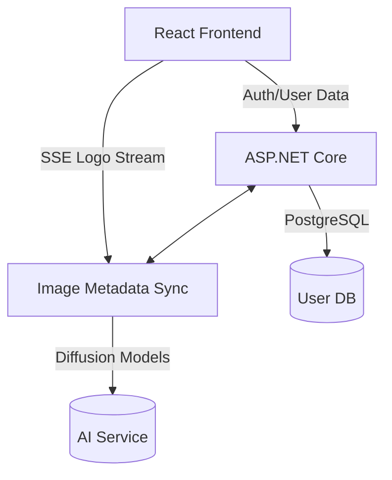
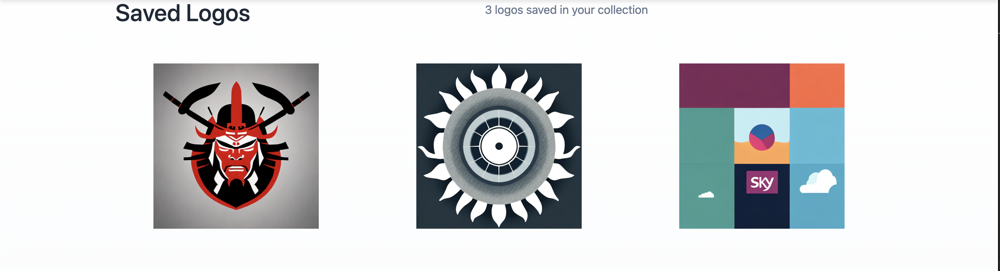
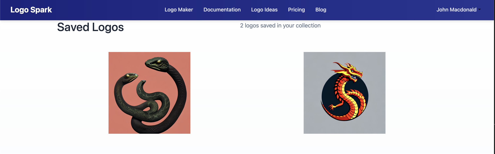
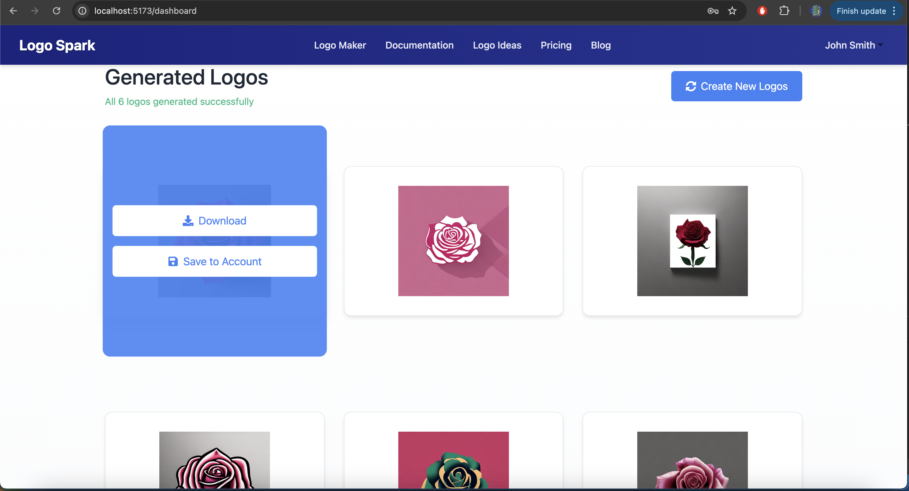

### **Project: LogoSpark**  
A full-stack AI-powered logo generation platform that combines a .NET backend for user management and a Python FastAPI service for AI-driven logo generation, paired with a modern React frontend. Ideal for startups, designers, and businesses needing rapid brand identity solutions.

---

### **Key Features**  
1. **AI-Powered Logo Generation**:  
   - Generate 6 logo variants in real-time using diffusion models (e.g., `openjourney-v4`).  
   - Progressive streaming via Server-Sent Events (SSE) with abortion controls.  
   - Prompt engineering enhances user input with style/quality descriptors.  

2. **User Management**:  
   - JWT-based authentication with ASP.NET Identity.  
   - Save logos to profiles, track generation history, and manage favorites.  

3. **Multi-Service Architecture**:  
   - **ASP.NET Core**: Handles auth, user data, and image metadata (PostgreSQL).  
   - **Python FastAPI**: Dedicated AI service for logo generation (Hugging Face `diffusers`).  
   - **React Frontend**: Interactive UI with real-time updates and responsive design.  

4. **Core Functionality**:  
   - Real-time dashboard with progress tracking and placeholders.  
   - Industry-specific logo inspiration gallery (15+ categories).  
   - Blog with markdown articles, pricing tiers, and documentation.  

---

### **Technologies Stack**  
| **Area**       | **Technologies**                                                                 |  
|----------------|----------------------------------------------------------------------------------|  
| **Backend**    | ASP.NET Core, Entity Framework, PostgreSQL, JWT, Swagger                        |  
| **AI Service** | Python, FastAPI, Hugging Face Diffusion Models, Torch, SSE                      |  
| **Frontend**   | React, React Router, Keen-Slider, React-Icons, LocalStorage, CSS Modules        |  
| **DevOps**     | REST APIs, CORS, Microservices Architecture, PostgreSQL Relations              |  

---

### **Architecture Flow**  

---

### **Key Components**  
1. **Backend (C#)**:  
   - `AuthController.cs`: JWT token generation and user management.  
   - `SavingController.cs`: Save/retrieve logos with PostgreSQL.  
   - `ApplicationDbContext.cs`: User-logo relationships with EF Core.  

2. **AI Service (Python)**:  
   - `AILogoModel.py`: Enhances prompts and generates logos via diffusion models.  
   - `app.py`: SSE streaming and task abortion handling.  

3. **Frontend (React)**:  
   - `Dashboard.jsx`: Real-time logo grid with progress tracking.  
   - `LogoMaker.jsx`: Input form triggering AI generation.  
   - `Blog.jsx`: Dynamic article rendering from markdown.  
   - `logoAPI.js`: Manages API/SSE connections.  

---

### **Highlights?**  
- **Polyglot Design**: Optimizes .NET for auth/data and Python for AI/ML.  
- **Real-Time UX**: Stream logos as they generate—no waiting for batch completion.  
- **Scalable**: PostgreSQL handles user growth; diffusion models support style expansions.  

#Progress Images#

